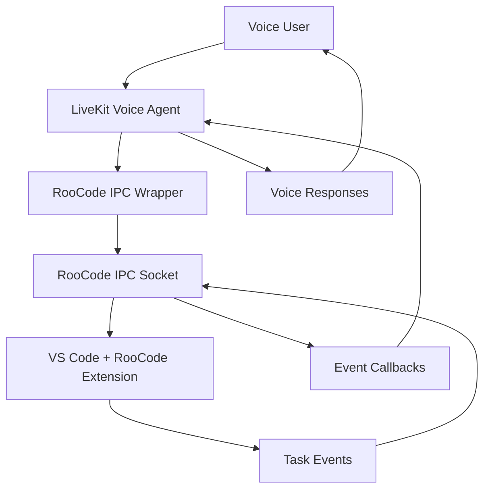

# RooCode Voice Interface Architecture Plan

## Overview
Complete voice interface for communicating with RooCode agent with all functions and events, but implemented with simple, clean code for easy debugging and extension.

## System Architecture



## Phase 1: Python IPC Wrapper Implementation

### Core Components

#### 1. RooCodeClient Class
```python
class RooCodeClient:
    def __init__(self, socket_path: str):
        self.socket_path = socket_path
        self.client_id = None
        self.connected = False
        self.event_callbacks = {}
    
    async def connect(self) -> bool:
        """Connect to RooCode IPC socket"""
        pass
    
    async def disconnect(self):
        """Disconnect from IPC socket"""
        pass
    
    async def send_command(self, command_name: str, data: dict):
        """Send command to RooCode"""
        pass
    
    def on_event(self, event_name: str, callback):
        """Register event callback"""
        pass
```

#### 2. Command Methods (All 4 commands)
- `start_new_task(text: str, configuration: dict = None, images: list = None, new_tab: bool = False)`
- `cancel_task(task_id: str)`
- `close_task(task_id: str)`
- `resume_task(task_id: str)`
- `send_message(text: str, images: list = None)` - **NEW: Send messages to active tasks**
- `press_primary_button()` - **NEW: Press primary button in UI**
- `press_secondary_button()` - **NEW: Press secondary button in UI**

#### 3. Complete Event Handling System
All 20+ events with simple callback registration:
- **Task Provider Lifecycle**: `TaskCreated`
- **Task Lifecycle**: `TaskStarted`, `TaskCompleted`, `TaskAborted`, `TaskFocused`, `TaskUnfocused`, `TaskActive`, `TaskInteractive`, `TaskResumable`, `TaskIdle`
- **Subtask Lifecycle**: `TaskPaused`, `TaskUnpaused`, `TaskSpawned`
- **Task Execution**: `Message`, `TaskModeSwitched`, `TaskAskResponded`, `TaskUserMessage`
- **Task Analytics**: `TaskTokenUsageUpdated`, `TaskToolFailed`
- **Configuration Changes**: `ModeChanged`, `ProviderProfileChanged`
- **Evals**: `EvalPass`, `EvalFail`

### Socket Communication Implementation

#### Platform-Specific Handling
- **Unix/Linux/macOS**: `/tmp/roo-code-{id}.sock`
- **Windows**: `\\.\pipe\roo-code-{id}`

#### Complete Message Format
```python
{
    "type": "TaskCommand" | "TaskEvent" | "Ack" | "Connect" | "Disconnect",
    "origin": "client" | "server",
    "clientId": "string (optional)",
    "data": "command or event payload"
}
```

## Phase 2: LiveKit Integration

### Complete Function Tools

#### 1. StartNewTaskTool
Full implementation with all parameters.

#### 2. CancelTaskTool  
Complete task cancellation functionality.

#### 3. CloseTaskTool
Full task closing implementation.

#### 4. ResumeTaskTool
Complete task resumption functionality.

#### 5. SendMessageTool - **NEW**
Send messages to active RooCode tasks.

#### 6. PressButtonTools - **NEW**
Press primary/secondary buttons in RooCode UI.

### Complete Callback Mechanism
Event handling for all 20+ events with simple registration:
- Real-time progress updates
- Task lifecycle notifications
- Error handling and reporting
- Configuration change notifications
- Completion and failure reporting

## Phase 3: Voice Agent System Prompt

### Complete Agent Role
- Full bridge between user voice commands and RooCode
- Translation of natural language to all RooCode capabilities
- Complete task status and results reporting
- Comprehensive error handling and recovery

### Full Conversation Patterns
- Natural language command interpretation
- Context-aware responses
- Error recovery and help
- Progress and status reporting
- Task management conversations
- **Interactive task communication** - Send messages during task execution

## Implementation Approach

### Phase 1: Python IPC Wrapper
- **Complete functionality**: All 4 commands and 20+ events
- **Simple implementation**: Straightforward code without unnecessary complexity
- **Basic error handling**: Clear error messages, simple retry logic
- **Platform support**: Both Windows and Unix socket handling

### Phase 2: LiveKit Integration  
- **Complete tool set**: All RooCode commands as voice tools
- **Simple callback system**: Direct event handling to voice responses
- **Basic voice response**: Clear, concise status updates

### Phase 3: Complete Voice Agent
- **Full system prompt**: Complete agent personality and capabilities
- **Natural conversation flow**: Human-like interaction patterns
- **Comprehensive responses**: Full range of voice feedback

## Technical Requirements

### Dependencies
- `asyncio` for async socket communication
- `json` for message serialization
- Platform-specific socket libraries
- LiveKit SDK

### Simple Error Handling
- Basic connection management
- Clear error messages for debugging
- Simple retry logic where needed
- Graceful failure handling

## Testing Strategy (Simple)

### Basic Functionality Testing
- All 4 commands work correctly
- All 20+ events properly handled
- Socket connection/disconnection
- Message sending/receiving
- **Interactive messaging capability**

### Simple Integration Testing
- Voice command to RooCode execution
- Event callback to voice response
- Basic error scenarios

## Success Criteria

### Complete Functionality
- ✅ All 4 commands fully implemented and working
- ✅ All 20+ events properly handled with callbacks
- ✅ Full socket communication on both Windows and Unix
- ✅ Complete LiveKit integration with voice tools
- ✅ **Interactive messaging to active tasks**

### Simple Implementation
- ✅ Clean, readable, well-commented code
- ✅ Minimal complexity and dependencies
- ✅ Clear error handling and debugging
- ✅ Easy to modify and extend

### Voice Interface Completeness
- ✅ Natural language to command translation
- ✅ Real-time progress and status updates
- ✅ Comprehensive error handling and recovery
- ✅ Full RooCode capability access via voice
- ✅ **Interactive communication with running tasks**