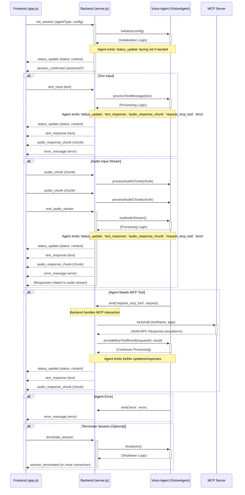

# VOX UI WebSocket Communication Protocol

**Version:** 1.0
**Date:** 2025-04-08

## Overview

This document defines the JSON-based message protocol used for real-time communication between the VOX UI Frontend (`app.js`) and the VOX UI Backend (`server.js`) over WebSockets. The backend acts as a manager for different Voice Agent implementations (conforming to `IVoiceAgent.ts`) and as an MCP gateway.

## General Principles

- All messages are JSON objects.
- Each message MUST have a `type` field indicating the message category.
- Payload structures are defined for each message type.
- Binary data (like audio chunks) should be Base64 encoded strings.
- The protocol directly supports the methods and events defined in `src/interfaces/IVoiceAgent.ts`.
- Status updates from the backend are designed to map clearly to the UI states defined in `cline_docs/status_indicator_design.md`.

## Message Flow Diagram



## Message Types

---

### 1. `init_session` (FE -> BE)

Initiates a new voice agent session. Corresponds to `IVoiceAgent.initialize()`.

**Payload:**

```json
{
  "type": "init_session",
  "payload": {
    "agentType": "string", // Identifier for the desired agent (e.g., "ultravox", "phi-4")
    "config": "object"     // Agent-specific configuration object
  }
}
```

**Example:**

```json
{
  "type": "init_session",
  "payload": {
    "agentType": "ultravox",
    "config": {
      "model": "default",
      "language": "en-US"
    }
  }
}
```

---

### 2. `session_confirmed` (BE -> FE)

Confirms that the agent session was successfully initialized.

**Payload:**

```json
{
  "type": "session_confirmed",
  "payload": {
    // "sessionId": "string" // Optional: If needed for future multiplexing
  }
}
```

**Example:**

```json
{
  "type": "session_confirmed",
  "payload": {}
}
```

---

### 3. `text_input` (FE -> BE)

Sends a complete text message from the user to the agent. Corresponds to `IVoiceAgent.processTextMessage()`.

**Payload:**

```json
{
  "type": "text_input",
  "payload": {
    "text": "string" // The user's text input
  }
}
```

**Example:**

```json
{
  "type": "text_input",
  "payload": {
    "text": "What's the weather like today?"
  }
}
```

---

### 4. `audio_chunk` (FE -> BE)

Sends a chunk of audio data from the user's microphone stream. Corresponds to `IVoiceAgent.processAudioChunk()`.

**Payload:**

```json
{
  "type": "audio_chunk",
  "payload": {
    "chunk": "string" // Base64 encoded audio data chunk
  }
}
```

**Example:**

```json
{
  "type": "audio_chunk",
  "payload": {
    "chunk": "YWFhYWFhYWFh..." // Example Base64 string
  }
}
```

---

### 5. `end_audio_stream` (FE -> BE)

Signals that the user has finished sending audio chunks for the current stream. Corresponds to `IVoiceAgent.endAudioStream()`.

**Payload:**

```json
{
  "type": "end_audio_stream",
  "payload": {}
}
```

**Example:**

```json
{
  "type": "end_audio_stream",
  "payload": {}
}
```

---

### 6. `status_update` (BE -> FE)

Provides an update on the agent's current status. Corresponds to the `IVoiceAgent` 'status_update' event and maps to UI states in `status_indicator_design.md`.

**Payload:**

```json
{
  "type": "status_update",
  "payload": {
    "status": "string", // Required: One of 'idle', 'listening', 'processing', 'speaking', 'error', 'notifying'
    "context": {        // Optional: Provides more detail for specific UI rendering
      "type": "string", // Optional: e.g., 'tool_execution', 'transcribing', 'generating_response', 'custom'
      "label": "string" // Optional: Specific text for the status bar (e.g., "Executing: brave_search...")
    }
  }
}
```

**Examples:**

```json
// Simple idle state
{
  "type": "status_update",
  "payload": {
    "status": "idle"
  }
}

// Processing state while waiting for an MCP tool
{
  "type": "status_update",
  "payload": {
    "status": "processing",
    "context": {
      "type": "tool_execution",
      "label": "Executing: Get Weather..."
    }
  }
}

// Speaking state
{
  "type": "status_update",
  "payload": {
    "status": "speaking"
  }
}
```

---

### 7. `text_response` (BE -> FE)

Sends a complete text response generated by the agent. Corresponds to the `IVoiceAgent` 'text_response' event.

**Payload:**

```json
{
  "type": "text_response",
  "payload": {
    "text": "string" // The agent's text response
  }
}
```

**Example:**

```json
{
  "type": "text_response",
  "payload": {
    "text": "The weather today is sunny with a high of 75 degrees."
  }
}
```

---

### 8. `audio_response_chunk` (BE -> FE)

Sends a chunk of audio data generated by the agent (e.g., TTS). Corresponds to the `IVoiceAgent` 'audio_response_chunk' event.

**Payload:**

```json
{
  "type": "audio_response_chunk",
  "payload": {
    "chunk": "string" // Base64 encoded audio data chunk
  }
}
```

**Example:**

```json
{
  "type": "audio_response_chunk",
  "payload": {
    "chunk": "YWFhYWFhYWFh..." // Example Base64 string
  }
}
```

---

### 9. `error_message` (BE -> FE)

Reports an error that occurred either in the backend WebSocket handling or within the voice agent itself. Corresponds to the `IVoiceAgent` 'error' event or other backend errors.

**Payload:**

```json
{
  "type": "error_message",
  "payload": {
    "message": "string", // Human-readable error message
    "code": "string",    // Optional: Application-specific error code
    "details": "any"     // Optional: Additional error details
  }
}
```

**Example:**

```json
{
  "type": "error_message",
  "payload": {
    "message": "Failed to initialize the voice agent: Invalid API key.",
    "code": "AGENT_INIT_FAILURE",
    "details": { "reason": "Authentication failed" }
  }
}
```

---

### 10. `terminate_session` (FE -> BE) (Optional)

Requests the backend to shut down the current agent session. Corresponds to `IVoiceAgent.shutdown()`. *Note: Alternatively, simply closing the WebSocket connection could trigger this.*

**Payload:**

```json
{
  "type": "terminate_session",
  "payload": {}
}
```

---

### 11. `session_terminated` (BE -> FE) (Optional)

Confirms that the agent session has been shut down. *Note: May not be needed if connection closure is the primary mechanism.*

**Payload:**

```json
{
  "type": "session_terminated",
  "payload": {}
}
```

---

---

### 12. `get_settings` (FE -> BE)

Requests the current application settings from the backend.

**Payload:**

```json
{
  "type": "get_settings",
  "payload": {}
}
```

---

### 13. `settings_data` (BE -> FE)

Sends the complete current application settings object to the frontend in response to `get_settings` or potentially after an update.

**Payload:**

```json
{
  "type": "settings_data",
  "payload": {
    "settings": {
      "theme": "string",
      "mcp_config_path": "string",
      "active_voice_agent": "string",
      "voice_agent_config": {
        // Agent-specific configs keyed by agentType
        "ultravox": { /* ... */ },
        "phi4": { /* ... */ }
      }
      // ... any other settings ...
    }
  }
}
```

---

### 14. `update_settings` (FE -> BE)

Sends the complete, updated settings object from the frontend to be saved by the backend.

**Payload:**

```json
{
  "type": "update_settings",
  "payload": {
    "settings": {
      "theme": "string",
      "mcp_config_path": "string",
      "active_voice_agent": "string",
      "voice_agent_config": {
         // Agent-specific configs keyed by agentType
        "ultravox": { /* ... */ },
        "phi4": { /* ... */ }
      }
      // ... any other settings ...
    }
  }
}
```

---

### 15. `settings_update_ack` (BE -> FE)

Acknowledges whether the `update_settings` request was successful.

**Payload:**

```json
{
  "type": "settings_update_ack",
  "payload": {
    "success": "boolean", // True if saved successfully, false otherwise
    "error": "string | null" // Error message if success is false
  }
}
```

---
